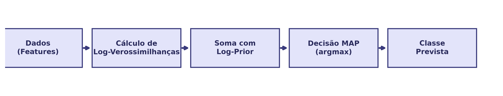
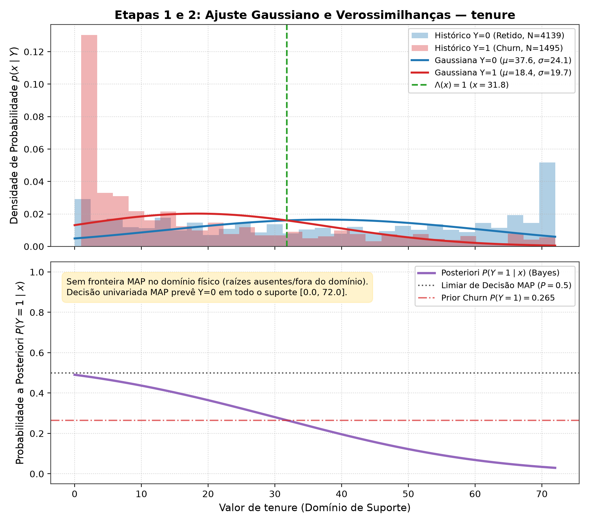
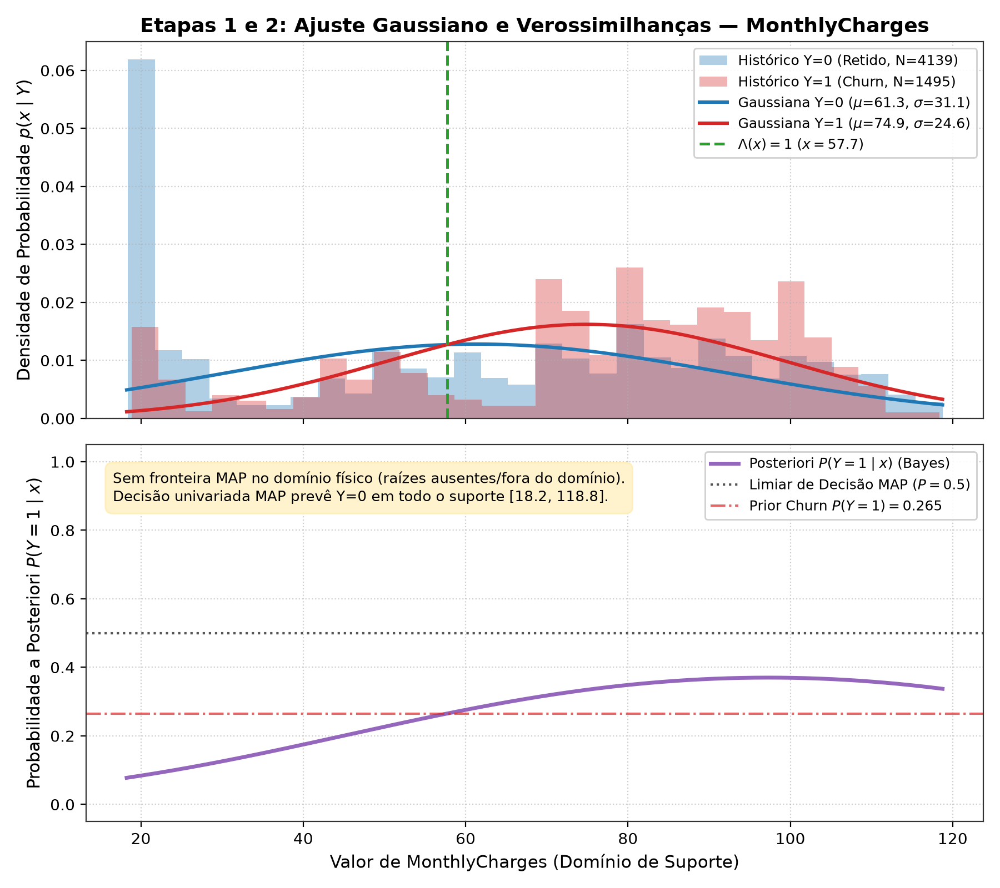
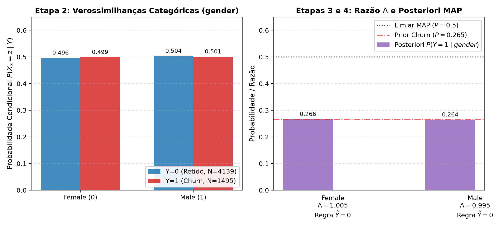
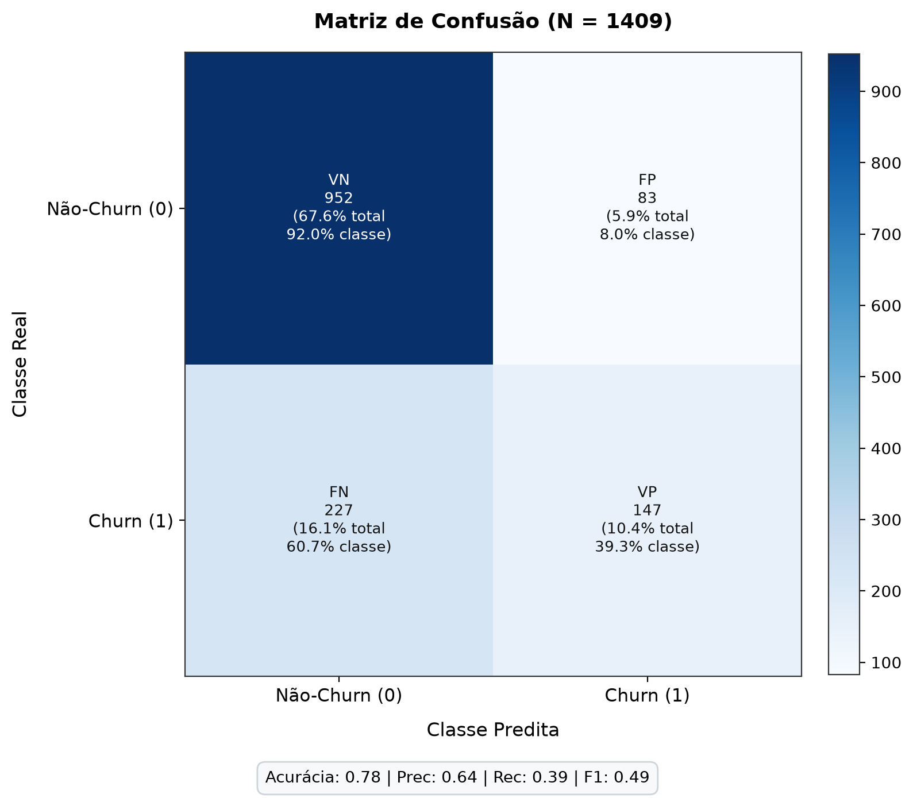

# Estudo Dirigido – Inteligência Artificial 2026.1



**Universidade Federal do Agreste de Pernambuco (UFAPE)**
**Bacharelado em Ciência da Computação**
**Docente:** Prof. Dr. Luis Filipe
**Discentes:** Dimas Neto e Julio Neto

---

## 1. Visão Geral do Projeto

Este projeto consiste na implementação analítica e validação de classificadores Bayesianos aplicados ao problema de previsão de evasão de clientes (*Customer Churn*), utilizando a base pública **Telco Customer Churn** (Kaggle / IBM). 

O foco é a demonstração prática dos fundamentos estatísticos (densidades contínuas Gaussianas, distribuições de Bernoulli e fronteiras de decisão) combinados para a formulação de um classificador **Naive Bayes Híbrido**.

---

## 2. Base de Dados e Hipóteses

O dataset possui $7.043$ observações. As características selecionadas para o estudo foram:

1. **$X_1$ (`tenure`)**: Tempo de permanência do cliente (em meses). Variável discreta modelada por **Aproximação Gaussiana**.
2. **$X_2$ (`MonthlyCharges`)**: Valor da fatura mensal. Variável contínua modelada por **Aproximação Gaussiana**.
3. **$X_3$ (`gender`)**: Gênero do cliente. Variável categórica binária modelada por **Distribuição de Bernoulli**.
4. **$Y$ (`Churn`)**: Variável alvo indicando o cancelamento do serviço (`No = 0`, `Yes = 1`).

---

## 3. Descobertas e Análise Univariada

Os parâmetros foram estimados sobre a partição de treinamento ($80\%$ da base). A classe Retido é majoritária, representando $\approx 73,46\%$ dos dados, o que estabelece uma forte probabilidade a priori contra a predição de evasões sem fortes evidências adicionais.

### 3.1 Tempo de Permanência (`tenure`)
Clientes com menor tempo de contrato têm probabilidade muito maior de cancelar o serviço. Há uma clara separabilidade nos primeiros meses, o que torna esta característica fortemente discriminatória.



### 3.2 Mensalidade (`MonthlyCharges`)
A cobrança mensal apresentou comportamento bimodal nas duas classes, refletindo prováveis pacotes de serviço distintos (básico vs premium). A modelagem por uma única Gaussiana é uma simplificação teórica do estudo.



### 3.3 Gênero (`gender`)
O gênero do cliente não demonstrou poder discriminatório para este problema. As proporções de cancelamento são idênticas entre os sexos.



---

## 4. Avaliação Final do Naive Bayes Híbrido

A validação do classificador conjunto foi executada no conjunto de teste congelado ($20\%$ da base).

### Matriz de Confusão Canônica


### Métricas de Desempenho
- **Acurácia:** $78,00\%$
- **Precisão:** $63,91\%$
- **Revocação (Recall):** $39,30\%$
- **F1-Score:** $48,68\%$

**Interpretação:** 
O classificador assume uma postura conservadora devido ao forte peso da probabilidade *a priori* de retenção. Ele tem uma boa taxa de acertos nos casos de manutenção do cliente e uma precisão aceitável ($63,91\%$) quando afirma que um cliente irá evadir. Contudo, essa cautela acarreta um recall baixo ($39,30\%$), não detectando a maioria dos evadidos reais.

---

## 5. Instalação e Execução

O projeto requer **Python 3.12**. Todo o código e dependências foram isolados.

```bash
# 1. Clone o repositório
git clone <URL_DO_REPOSITORIO>
cd estudo-dirigido-ia-segunda-va-2026-1

# 2. Obtenha manualmente o dataset
mkdir -p dataset
# Baixe WA_Fn-UseC_-Telco-Customer-Churn.csv do Kaggle e coloque em dataset/

# 3. Crie o ambiente virtual e instale as dependências
python3 -m venv venv
source venv/bin/activate
pip install -r requirements.txt

# 4. Rode os experimentos (Gera todos os resultados e figuras em output/)
python run_experiments.py --stage all

# 5. Rode a suíte de validação e testes
pytest tests/ -v
```
